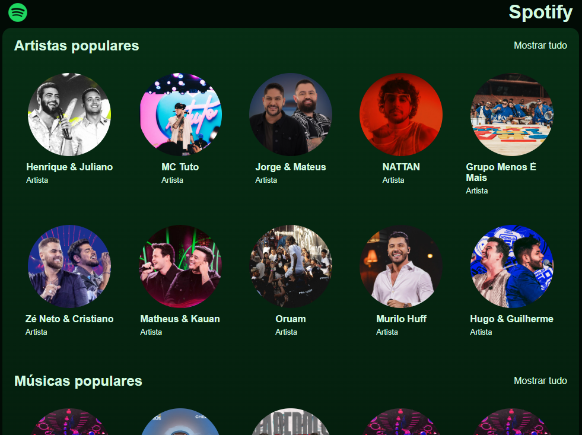

<h1 align="center">
  🎧 Spotify
</h1>

  

<h4 align="center"><a href="">Clique para visitar o projeto</a></h4>

## 📚 Sobre o projeto

Desenvolvi este projeto durante a Jornada Full Stack da Hashtag Treinamentos, criando uma réplica do Spotify. A aplicação permite visualizar artistas e músicas em destaque, as faixas mais tocadas e uma lista de músicas de cada artista.

O projeto foi estruturado com foco em componentização, garantindo dinamismo e reutilização eficiente de elementos da interface. Além disso, para um melhor controle dos dados e maior escalabilidade do código, implementei TypeScript por iniciativa própria. 🚀

## 🧑🏽‍💻 Funcionalidades | Interações

☑️ Visualizar um layout adequado ao seu dispositivo.  
☑️ Alternar entre páginas por meio do React Router, além do uso das funções useLocation e useParams. 
☑️ Exibir informações gerais e individuas de músicas e artistas. 
☑️ Tocar/Pausar uma música específica de cada artista ao clicar no botão de play e pause. 

## 🛠️ Tecnologias utilizadas

- ReactJS
- React Router
- Axios
- FontAwasomeIcon
- TypeScript
- Node
- Express
- MongoDB
